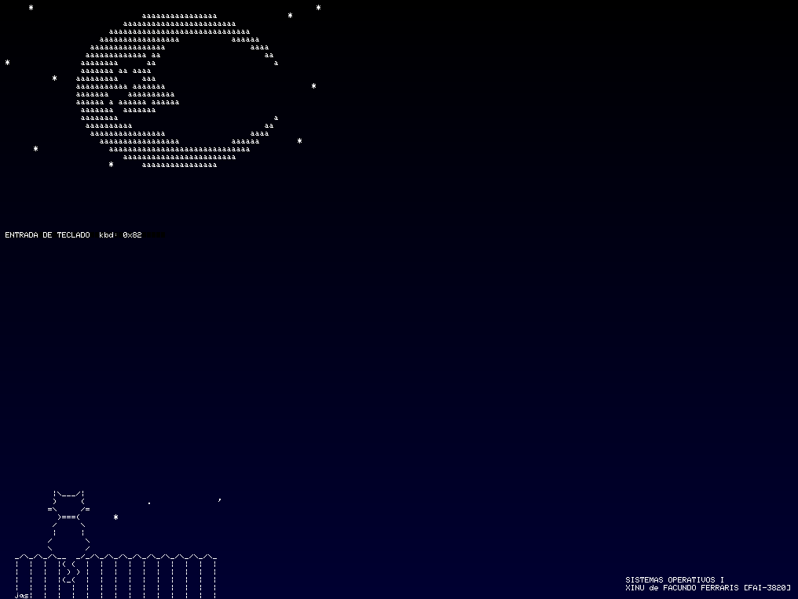
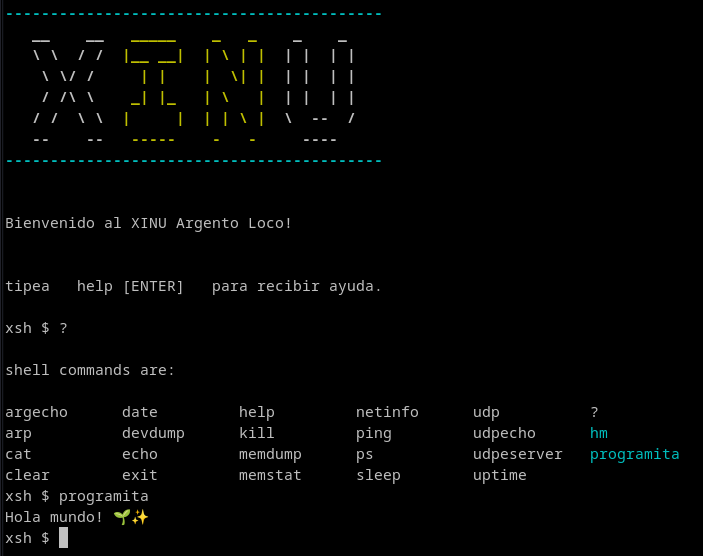

# [**Resultados TP 1 🖥️✨**](./README.md#-trabajo-practico-1-trabajando-con-xinu)

_Alumno:_ [Facundo Ferraris [FAI-3810]](https://github.com/Facundo-Sebastian-Ferraris/SistemasOperativosI)

## [**1. Primeros pasos con XINU** 👣](./README.md#-ejercicio-1-primeros-pasos-con-xinu)

### **🔧 Componentes principales del sistema Xinu:**

Basándonos en el [árbol de archivos de XINU](./XinuTree.txt), podemos encontrar:

1. **⚙️ Núcleo (Kernel)**  
   - 🏗️ Gestión de procesos (`create.c`, `kill.c`).  
   - ⏳ Planificación (`resched.c`).  
   - 🔒 Sincronización (`semaphore.c`).  
   - ⚡ Interrupciones (`intr.S`).  
   - 🧠 Memoria (`meminit.c`).  

2. **📂 Sistema de archivos**  
   - 💾 **Local** (`lfs*`).  
   - 🌐 **Remoto** (`rfs*`).  
   - 🚀 **RAM disk** (`ram*.c`).  

3. **🌐 Redes**  
   - 📶 **Tarjeta de red Intel 82545EM** (`eth*.c`).  
   - 🕸️ **Protocolos**: ARP, IP, UDP (`arp.c`, `ip.c`).  
   - 📡 **DHCP & DNS** (`dhcp.c`, `dns.c`).  

4. **🐚 Shell y comandos**  
   - 💻 Intérprete (`shell.c`).  
   - 📜 Comandos (`xsh_*.c` como `xsh_ping`, `xsh_arp`).  

5. **📚 Bibliotecas estándar**  
   - 📝 Funciones de C (`str*.c`, `printf.c`).  

---

### **🖥️ Periféricos soportados:**

| **Periférico**         | **Drivers/Archivos** |  
|----------------------  |----------------------|  
| **Consola/VGA** 🖥️     | `vga.c`, `text_on_vga.c` |  
| **Teclado** ⌨️          | `kbd*.c` |  
| **Mouse** 🐭            | `mice*.c` |  
| **Red (Ethernet)** 🌐   | `eth*.c`, `e1000e.h` |  
| **RAM Disk** 💾         | `ram*.c` |  
| **PCI** 🔌              | `pci.c` |  
| **Reloj (RTC)** ⏰     | `clk*.c` |  

---

### **🔍 Observaciones extra:**

- **Arquitectura**: El código está orientado a x86 (ejemplo: `i386.c`, `start.S`)
- **Arranque MultiBoot**: Soporte para arranque via GRUB (`multiboot.h`) 🚀
- **Modo protegido**: Manejo de interrupciones y contexto de CPU (`ctxsw.S`, `intr.S`)🛡️  

---

### **Acceso al puerto serial de XINU** 🖥️🔌  

QEMU ofrece la opción de mostrar las pestañas de secciones, entre ellas está `serial0`. Haciendo clic en ella o usando `Ctrl + Alt + 3`, podrás acceder al **shell del sistema**.  

---

### **Visualización de Procesos** 📊👀  

Para ver los procesos en ejecución, usa el comando `ps` (**Process Status**). Este muestra una lista de todos los procesos activos, incluyendo sus **IDs, estados, prioridades** y más detalles.  

🔹 **Ejemplo de salida:**

```bash
Pid Name             State Prio Ppid Stack Base Stack Ptr  Stack Size
--- ---------------- ----- ---- ---- ---------- ---------- ----------
  0 prnull           ready    0    0 0x005FDFFC 0x00146284     8192
  1 rdsproc          susp   200    0 0x005FBFFC 0x005FBFC8    16384
  3 Main process     recv    20    2 0x005E7FFC 0x005E7F64    65536
  4 shell            recv    50    3 0x005F7FFC 0x005F7C7C     8192
 11 ps               curr    20    4 0x005F5FFC 0x005F5FC4     8192

```

#### **🔍 Explicación clave del resultado anterior:**

1. **PID (Process ID)**: Identificador único del proceso.  
   - `0` (`prnull`): Proceso especial (nulo/inactivo).  
   - `1` (`rdsproc`): Proceso relacionado con **disco remoto** (suspendido).  
   - `3` (`Main process`): Proceso principal (en estado `recv`, esperando mensajes).  
   - `4` (`shell`): ¡El shell de Xinu! (también en `recv`).  
   - `11` (`ps`): **Proceso actual** (el que se ejecutó).  

2. **Estados (`State`)**:  
   - `ready` ⏳🚀: Listo para ejecutarse.  
   - `susp` 🛑💤: Suspendido (ejemplo: `rdsproc`).  
   - `recv` ✉️🤔: Esperando recibir un mensaje (como el `Main process` y el `shell`).  
   - `curr` ⚡🔥: En ejecución actual (`ps`).  

3. **Prioridad (`Prio`)**:  
   - Mayor número = Mayor prioridad (ejemplo: `rdsproc` tiene `200`).  

4. **PPID (Parent PID)**:  
   - El `shell` (PID `4`) fue creado por el `Main process` (PID `3`).  
   - El comando `ps` (PID `11`) fue lanzado desde el `shell` (PID `4`).  

5. **Stack (Pila)**:  
   - Direcciones de memoria y tamaño asignado a cada proceso.  

---

#### **🚀 ¿Qué podemos concluir?**  

- El **`shell`** (PID `4`) es el proceso interactivo que usas para ejecutar comandos.  
- El **`Main process`** (PID `3`) parece ser el núcleo del sistema, esperando eventos.  
- **`rdsproc`** (PID `1`) está suspendido, posiblemente relacionado con el sistema de archivos remoto (`rds`).  
- **`ps`** se ejecutó correctamente y terminó (por eso ya no aparece en `curr` si lo vuelves a listar).  

---

#### **💡 Comandos útiles para profundizar:**  

- **`kill <PID>`**: Terminar un proceso (ejemplo: `kill 1` para cerrar `rdsproc`).  
- **`memstat`**: Ver uso de memoria (si hay fugas en procesos).  

## [2. Modificación del VGA 🎨](./README.md#-ejercicio-2-modificación-de-xinu)

En el directorio `system` encontramos el archivo `main.c`, el cual contiene instrucciones básicas como:  

- Pintar la pantalla de amarillo (`paint_screen()`) 🟨  
- Imprimir texto en la pantalla VGA usando `print_text_on_vga(x, y, s)`, donde:  
  - `x` = posición horizontal  
  - `y` = posición vertical (aumenta hacia abajo)  
  - `s` = texto a mostrar  

### 🛠️ Modificaciones realizadas  

#### 1. **Fondo con Degradado** 🌈

Se modificó `paint_screen()` para que genere un **degradado suave** desde negro hasta un color personalizado, en lugar de un fondo plano.  

#### 2. **Texto en Blanco** ⚪

El color del texto se cambió a **blanco** para garantizar un buen contraste con el fondo oscuro del degradado.  

#### 3. **ASCII Art + Datos del Alumno** 🎨📝

En [`main.c`](../../xinu-pc/system/main.c), se agregó una función `printWallpaper()` que muestra:  

- **Arte ASCII** (diseños creados con caracteres).  
- **Nombre y legajo del alumno** en un formato visualmente atractivo.  

#### 🎨 **Manejo de Colores Simplificado**

Para facilitar el trabajo con colores, se incluyó la librería **[colores.h](../../xinu-pc/include/colores.h)**, que contiene:  

- **Constantes predefinidas** en formato hexadecimal (ej: `COLOR_ROJO = 0xFFFF0000`).  
- **Funciones útiles**:  
  - `ARGB(a, r, g, b)` → Genera un color personalizado en formato **ARGB**.  
  - `GET_A(color)`, `GET_R(color)`, `GET_G(color)`, `GET_B(color)` → Extraen componentes del color.  

🔹 **Formato ARGB**:

- **A** (Alpha - Transparencia)  
- **R** (Rojo)  
- **G** (Verde)  
- **B** (Azul)  

### 🚀 Visualizacion de la imagen



## [3. Incorporacion de programas en XINU 🖥️](./README.md#-ejercicio-3-incorporar-un-programa-al-shell-de-xinu)

Para la instalacion de cualquier programa en XINU se debe tener ciertos recaudos, como por ejemplo que el metodo del codigo principal no debe llamarse `main()` y debe tener el prefijo `xsh` (que se explicara mas adelante, [click aqui para explicacion](#importancia-de-que-el-prototipo-no-debe-llamarse-main))
por lo que tendremos que llamarlo de otra forma, a modo de protocolo lo nombramos agregando de prefijo `xsh_`, ademas que es un void por lo que no es necesario indicarlo.

```c
#include <xinu.h>
xsh_mi_programa()
{
    kprintf("Hola mundo! 🌱✨\n");
}
```

Una vez realizado el codigo, el archivo debe encontrarse en la carpeta de shell ya que es la interfaz de usuario.

```bash
📦shell
 .
 .
 .  
 ┣ 📜xsh_HolaMundo.c
 .
 .
 .
 ```

Luego debemos exportar el metodo principal del programa en dos archivos del xinu:

### `shprototypes.h (shell prototypes)`

Esta libreria importa todos los programas accesibles para el usuario. Es aqui donde debemos colocar el metodo principal del codigo.

```c
.
.
.
/* in file xsh_uptime.c */
extern shellcmd xsh_uptime(int32, char *[]);

/* in file xsh_help.c */
extern shellcmd xsh_help(int32, char *[]);

extern shellcmd xsh_ahorcado();

extern shellcmd xsh_mi_programa(); 
```

Donde `shellcmd` es un `typedef` que representa la `firma estándar` que deben tener todas las funciones que implementan comandos del shell.

> - Un `typedef` es la forma de crear alias en C para tipos de datos existentes, en este caso:
   `typedef int32  shellcmd;   /* shell command declaration*/`
> - Una `firma estándar` es un formato consistente que deben seguir todas las funciones de cierto tipo, por ejemplo:
   `extern shellcmd xsh_help(int32, char *[]);`

### `cmdtab.c`

Este código contiene un arreglo del tipo cmdent. Este tipo de dato es una estructura que se ve de la siguiente manera:

```c
struct cmdent
{ /* Entry in command table*/
 char *cname; /* Name of command*/
 bool8 cbuiltin; /* Is this a builtin command?*/
 int32 (*cfunc)(int32, char *[]); /* Function for command*/
};
```

En el cual se tiene:

- **Un nombre de comando `*cname`**: para cuando se ingresa ese nombre desde la terminal, el programa se ejecute.
- **Un estado builtin `cbuiltin`**: para determinar si el proceso del programa es "killeable" (FALSE para que sea "killable")
- **Funcion del prototipo `*cfunc`**: el prototipo del programa en cuestion

```c
const struct cmdent cmdtab[] = {
   .
   .
   .
   {"?", FALSE, xsh_help},                // 20
   {"hm", FALSE, xsh_ahorcado},           // 21
   {"programita", FALSE, xsh_mi_programa} // 22 NUEVO PROGRAMA INGRESADO
```

#### **🎯 Implicancias de un proceso killable o no killable**

##### **🔥 Procesos Killable (builtin = FALSE)**

###### ✅ **Ventajas** 🔥

1. **Control de usuario** 👨‍💻  
   - Los usuarios pueden matar procesos que se cuelgan o consumen muchos recursos

2. **Aislamiento de fallos** 🛡️  
   - Si el proceso falla, no afecta al shell principal

3. **Liberación de recursos** ♻️  
   - Al matar el proceso, se liberan:  
     - Memoria
     - Dispositivos bloqueados
     - Entradas en la tabla de procesos

###### ❌ **Riesgos** 🔥

1. **Terminación accidental** 💥  
   - Un usuario podría matar procesos importantes por error

2. **Corrupción de estado** 🦠  
   - Si el proceso estaba escribiendo en un archivo/dispositivo, podría dejar datos inconsistentes

3. **Huérfanos** 👶  
   - Procesos hijos podrían quedar huérfanos si el padre es killado

---

##### 🛡️**Procesos No-Killable (`builtin = TRUE`)**

###### ✅ **Ventajas** 🛡️

1. **Estabilidad del sistema** 🏗️  
   - Comandos críticos como `exit` o `kill` siempre estarán disponibles

2. **Acceso privilegiado** 🔑  
   - Pueden modificar estructuras internas del kernel con seguridad

3. **Consistencia** 📊  
   - Evitan estados inconsistentes al no poder ser interrumpidos abruptamente

###### ❌ **Riesgos** 🛡️

1. **Posibles deadlocks** 🔄  
   - Si un comando built-in se bloquea, puede congelar todo el shell

2. **Abuso de recursos** 🐖  
   - Un loop infinito en un built-in consumiría recursos indefinidamente

3. **Dificultad para depurar** 🐛  
   - No se puede "matar" para reiniciar el shell fácilmente

---

##### 📊 **Tabla Comparativa Crítica**

| Aspectos              | Killable                    | No-Killable              |
|:---------------------:|-----------------------------|--------------------------|
| **Seguridad**         | ❌ Riesgo de terminación    | ✅ Estable               |
| **Flexibilidad**      | ✅ Usuario tiene control    | ❌ Rígido                |
| **Uso de recursos**   | ❌ Puede dejar fugas        | ✅ Limpieza garantizada  |
| **Implementación**    | Más simple                  | Requiere sincronización  |
| **Ejemplos típicos**  | `ping`, `hm` _(ahorcado)_     | `exit`, `kill`, `clear`  |

---

##### **💡 Cuando usar cada uno?**

1. **Usar `builtin = TRUE` solo para**:
   - Comandos que gestionan el ciclo de vida del shell (`exit`)
   - Herramientas de administración crítica (`kill`)

2. **Usar `builtin = FALSE` para**:
   - Aplicaciones de usuario (como tu juego)
   - Comandos que no modifican estado global

3. **Excepciones**:
   - `clear` es built-in (aunque no parece crítico) porque:
     - Debe acceder directamente al buffer de video
     - Es rápido y no debe fallar

---

### Salida de pantalla desde XINU



#### Observación

Al ejecutar el comando de ayuda nos despliega la lista de programas que se pueden ejecutar. Entre estas apareceran las que instalamos.

Al tipear el comando `programita`, se ejecutara nuestro código.

### Importancia de que el prototipo ^no^ debe llamarse main

1. **El kernel ya tiene su propio `main()`**  
   Xinu tiene una función `main()` principal en el kernel que:
   - Inicializa todo el sistema operativo
   - Configura hardware
   - Lanza el shell primario

   ```c
   // En el código base del kernel:
   int main(void) {
       /* Inicialización del sistema */
       ...
   }
   ```

2. **Problema de enlazado (linking)**  
   Si múltiples archivos definieran `main()`, el linker no sabría cuál es el verdadero punto de entrada, causando errores como:

   ```bash
   multiple definition of `main'
   ```

### 🔄 **Cómo Funciona el Modelo de Xinu**

- **Programas como comandos del shell**:  
  Cada "programa" es en realidad una función registrada en la tabla de comandos (`cmdtab`).

- **Estructura típica**:

  ```c
  #include <xinu.h>
  
  void xsh_mi_programa(void) {  // ¡No es main()!
      kprintf("Hola desde Xinu!\n");
  }
  ```

### ⚙️ **Detalles Técnicos**

1. **Namespace del kernel**  
   Xinu mantiene un espacio de nombres plano (no hay namespaces como en C++), por lo que los nombres deben ser únicos.

2. **Protocolo de prefijos**  
   La convención `xsh_` (eXinu SHell) ayuda a:
   - Evitar colisiones
   - Identificar claramente comandos del shell
   - Organizar el código

3. **Sistema de build**  
   El Makefile de Xinu espera esta estructura:

   ```makefile
   # Busca funciones con prefijo xsh_ para incluirlas
   COMMANDS += xsh_mi_programa.o
   ```

### 💡 **Ejemplo Práctico**

Así es como Xinu maneja el punto de entrada real vs. comandos:

```c
// kernel/main.c
int main(void) {            // Punto de entrada REAL
    ... // Inicialización
    shell();               // Lanza el shell
}

// shell/shell.c
void shell(void) {
    while(1) {
        // Busca en cmdtab (que contiene xsh_*)
        ejecutar_comando(entrada_usuario);
    }
}
```

### 🚫 **¿Qué pasaría si usaras main()?**

1. **Error de compilación**: En sistemas con protección de símbolos.
2. **Comportamiento indefinido**: En otros casos, el programa podría:
   - Reemplazar el main() del kernel (¡catastrófico!)
   - Generar un ejecutable que no arranca
   - Causar corrupción de memoria

### ✅ **Best Practice en Xinu**

Siempre usa:

```c
void xsh_nombre_programa(void) { ... }
```

Y regístralo en:

1. `shprototypes.h` (declaración)
2. `cmdtab[]` (tabla de comandos)

### 🌟 **Excepción Notable**

El único archivo que debe contener `main()` es el que inicia el kernel, típicamente:

```bash
xinu-pc/system/initialize.c
```
